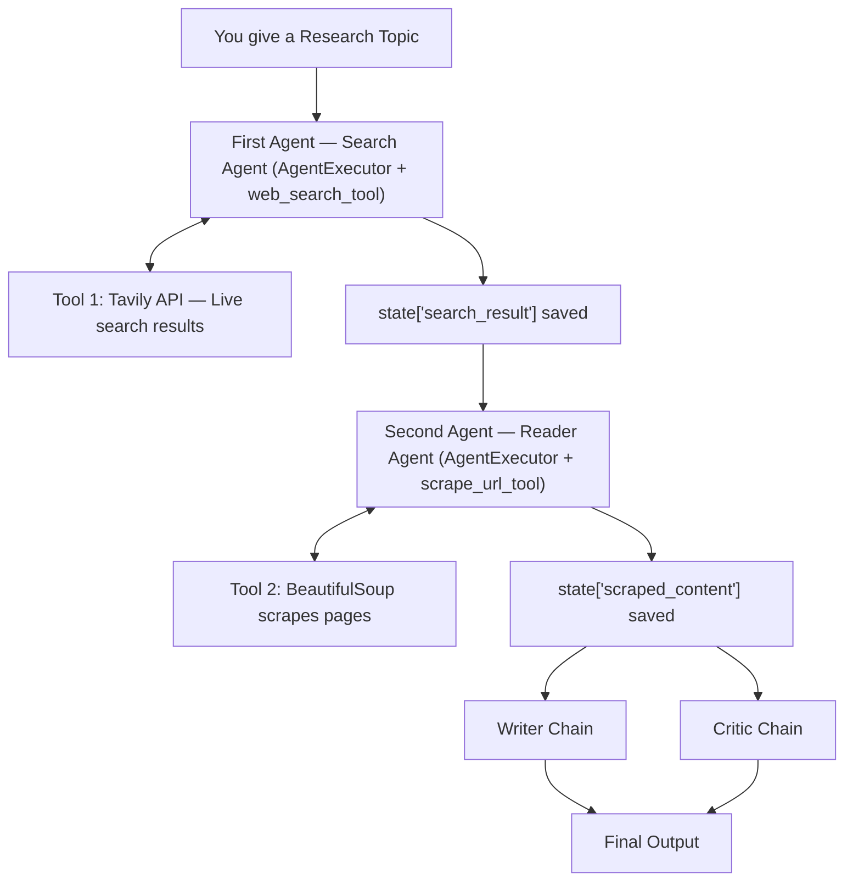

# 🔬 ResearchMind

**A fully autonomous Multi-Agent AI Research Assistant** powered by **Google Gemini**. Four specialized agents search, read, write, and critique to produce a professional research report on any topic.

Built with LangChain (LCEL) + LangGraph, using native tool-calling (no fragile text parsing).

## 🧠 Agents

| Agent | Role |
|---|---|
| 🔎 Search Agent | Finds recent sources via the Tavily API |
| 📄 Reader Agent | Scrapes the top source with BeautifulSoup |
| ✍️ Writer Chain | Drafts a structured Markdown report |
| 🧐 Critic Chain | Scores the report and gives feedback |

## ⚙️ Tech Stack
LangChain, LangGraph, **langchain-google-genai (Gemini)**, Tavily, BeautifulSoup4, Streamlit, Python 3.10+

### Architecture




## 📁 Structure
```
ResearchMind/
├── app.py          # Streamlit UI
├── agents.py       # Search/Reader agents, Writer/Critic chains (Gemini)
├── pipeline.py     # LangGraph orchestration
├── tools.py        # Tavily search + scrape tools
├── requirements.txt
├── .env.example
└── README.md
```

## 🚀 Getting Started

```bash
git clone https://github.com/Abhik004/ResearchMind.git
cd ResearchMind
python -m venv venv
source venv/bin/activate      # Windows: venv\Scripts\activate
pip install -r requirements.txt
```

Create a `.env` file:

```env
GOOGLE_API_KEY=your_gemini_api_key_here
TAVILY_API_KEY=your_tavily_api_key_here
```

> 🔑 Get a Gemini key at [aistudio.google.com/apikey](https://aistudio.google.com/apikey) and a Tavily key at [tavily.com](https://tavily.com).

Optional: set `GEMINI_MODEL` (default `gemini-2.5-flash`).

```bash
streamlit run app.py
```

## ☁️ Deployment (Streamlit Community Cloud)

1. Push to GitHub, then create a new app at [share.streamlit.io](https://share.streamlit.io) with main file `app.py`.
2. In **Settings → Secrets** add:
   ```toml
   GOOGLE_API_KEY = "your_gemini_api_key"
   TAVILY_API_KEY = "tvly-..."
   ```
3. Deploy.

## 📝 License
Open source. Fork and build on it.

Built by [Abhik](https://github.com/Abhik004)
